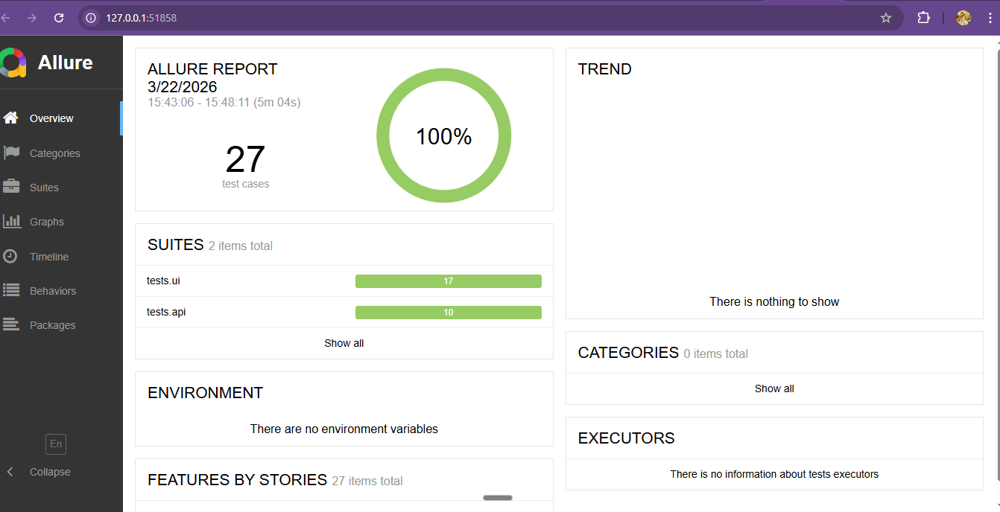

# E-Commerce Test Automation Framework


## About

A production-grade test automation framework for e-commerce web application
testing built with Python, Selenium WebDriver, and pytest.
Covers UI automation with Page Object Model and REST API validation.

## Tech Stack

| Layer          | Technology                  |
|----------------|-----------------------------|
| UI Automation  | Selenium WebDriver + POM    |
| Test Framework | pytest + markers            |
| API Testing    | Python requests             |
| Reports        | pytest-html + Allure        |
| Config         | configparser (config.ini)   |
| CI/CD          | GitHub Actions              |

## Project Structure

```
ECommerce_Automation/
├── config/
│   └── config.ini          # URLs, credentials, settings
├── pages/                  # Page Object Model classes
│   ├── base_page.py        # Common Selenium methods
│   └── login_page.py       # Login page actions & locators
├── api/
│   └── api_helper.py       # REST API helper methods
├── tests/
│   ├── ui/
│   │   ├── test_login.py           # 10 UI login tests
│   │   └── test_login_csv.py       # 7 data-driven login tests
│   └── api/
│       └── test_api.py             # 10 API tests
├── test_data/
│   └── login_data.csv      # CSV input for data-driven tests
├── utils/
│   └── data_reader.py      # CSV reader utility
├── reports/                # HTML + Allure reports
├── conftest.py             # Fixtures + screenshot hook
├── pytest.ini              # Markers and test configuration
└── requirements.txt
```

## Test Coverage

| Suite                  | Tests  | Type                      |
|------------------------|--------|---------------------------|
| Login & UI flows       | 10     | UI — Selenium             |
| Data-driven login      | 7      | UI — CSV parametrize      |
| Product & Customer API | 10     | REST API — requests       |
| **Total**              | **27** | **100% Pass Rate**        |

## How to Run

```bash
# Install dependencies
pip install -r requirements.txt

# Run all tests
pytest -v

# Run by marker
pytest -m smoke -v        # smoke tests only
pytest -m ui -v           # UI tests only
pytest -m api -v          # API tests only
pytest -m regression -v   # regression suite

# Generate HTML report
pytest -v --html=reports/html/report.html --self-contained-html

# Generate Allure report
pytest -v --alluredir=reports/allure
allure serve reports/allure
```

## Key Features

- Page Object Model for maintainable and scalable UI tests
- Data-driven testing with CSV — add new cases without touching code
- Auto screenshot on every test failure saved to reports/screenshots/
- pytest-html + Allure visual reports
- Auto ChromeDriver management via webdriver-manager
- pytest markers for selective test execution (smoke, ui, api, regression)
- Headless Chrome support for CI/CD environments
- GitHub Actions CI pipeline — runs on every push and pull request

## Test Sites

| Layer         | Site                                      | Purpose                              |
|---------------|-------------------------------------------|--------------------------------------|
| UI Automation | https://www.saucedemo.com                 | Login, session, and navigation flows |
| API Testing   | https://jsonplaceholder.typicode.com      | Product catalogue and customer REST API |

## Test Execution Report



> 27 test cases | 100% Pass Rate | UI + API Coverage
